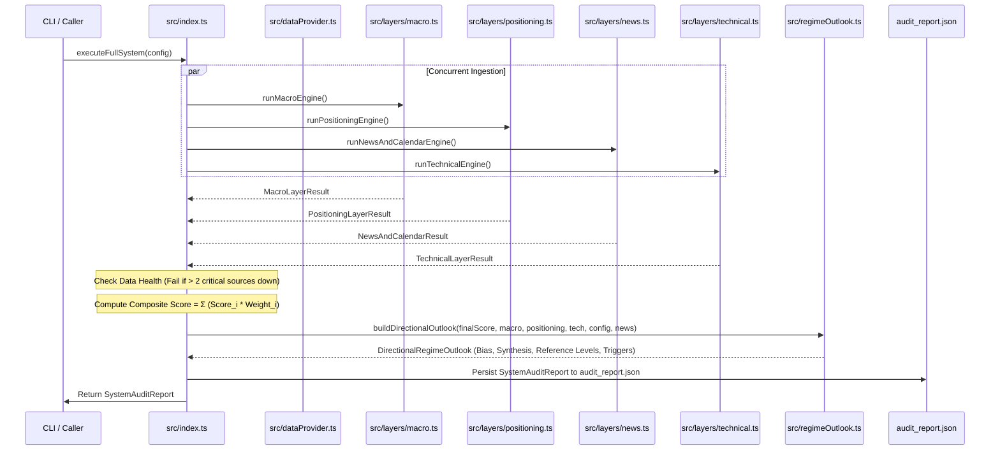

# TECHNICAL ARCHITECTURE & AI AGENT SPECIFICATION

> **Target Audience:** Autonomous AI coding agents, quantitative developers, and automated pipelines interacting with or refactoring this codebase.
> **Last Updated:** September 2026

---

## 1. System Invariants & Core Conventions

Any future AI agent modifying this codebase MUST respect these core system invariants:

1. **Sign Convention:**
   * **Negative Score ($-100$ to $0$):** Indicates **USD Advantage / EUR Weakness** (Bearish EUR/USD bias).
   * **Positive Score ($0$ to $+100$):** Indicates **EUR Advantage / USD Weakness** (Bullish EUR/USD bias).
   * **Zero ($0.0$):** Perfectly neutral fundamental parity.
2. **Thresholds & Layer Normalization:**
   * Conviction Threshold: $\pm 25.0$ (configured in `DEFAULT_CONFIG.convictionThreshold`).
   * Composite scores strictly bounded in $[-100.0, +100.0]$.
   * Continuous normalization must use hyperbolic tangent scaling (`tanhNormalize(z, sensitivity)`) rather than discrete knife-edge step functions to avoid boundary whipsaws.
3. **Technicals Policy & No Mechanical Signals:**
   * **Scoring Weight is 0% by default.** Technicals must NOT bias the fundamental composite score unless explicitly requested by the user or invoked via `--with-tech`.
   * **No Mechanical Trade Signals:** The engine does not prescribe rigid button-clicks (limit entries, stop losses, take profits, or lot sizing). Instead, local technical structure (5-day high/low, 20-day channel, ATR) is provided strictly as a **Structural Reference Framework** and spatial context for desks.
4. **Capital Preservation First:**
   * The engine must always prioritize capital preservation over trade frequency. Confluence Vetoes (Event-Risk, Short Squeeze, Liquidation) take absolute precedence over high conviction scores.
5. **No Synthetic Mocking in Production:**
   * Live endpoints must remain real-time HTTP calls with resilient fallback baselines rather than hardcoded mock stubs.

---

## 2. Architecture & Execution Lifecycle

The entry point is [`src/index.ts`](file:///src/index.ts) exporting `executeFullSystem(config?: SystemConfig): Promise<SystemAuditReport>`.



---

## 3. Data Providers & Ingestion Endpoints

All external I/O passes through `dataProvider` (`RobustDataProvider` singleton in [`src/dataProvider.ts`](file:///src/dataProvider.ts)):

| Data Metric | Provider / Endpoint | Fallback / Redundancy | Key Parameters / Series |
| :--- | :--- | :--- | :--- |
| **US 2Y Yield** | `https://fred.stlouisfed.org/graph/fredgraph.csv?id=DGS2` | Yahoo Finance `^IRX` | Series `DGS2`, daily |
| **US 10Y Yield** | `https://fred.stlouisfed.org/graph/fredgraph.csv?id=DGS10` | Yahoo Finance `^TNX` | Series `DGS10`, daily |
| **US 10Y TIPS** | `https://fred.stlouisfed.org/graph/fredgraph.csv?id=DFII10` | Baseline `2.63%` | 10Y Constant Maturity TIPS |
| **US 10Y Breakeven** | `https://fred.stlouisfed.org/graph/fredgraph.csv?id=T10YIE` | Baseline `2.35%` | 10Y Breakeven Inflation Rate |
| **Euro AAA 2Y Yield** | `https://data-api.ecb.europa.eu/service/data/YC/B.U2.EUR.4F.G_N_A.SV_C_YM.SR_2Y` | Baseline `2.10%` | Official ECB JSON API, `lastNObservations=35` |
| **Euro AAA 10Y Yield** | `https://data-api.ecb.europa.eu/service/data/YC/B.U2.EUR.4F.G_N_A.SV_C_YM.SR_10Y` | Baseline `2.35%` | Official ECB JSON API, `lastNObservations=35` |
| **Fed Funds EFFR** | `https://markets.newyorkfed.org/api/rates/unsecured/effr/last/30.json` | FRED `DFEDTARU`/`DFEDTARL` | NY Fed Reference Rates API |
| **ECB Deposit Rate** | `https://data-api.ecb.europa.eu/service/data/FM/B.U2.EUR.4F.KR.DFR.LEV` | Baseline `2.50%` | ECB DFR policy rate |
| **CFTC Euro FX CoT** | `https://publicreporting.cftc.gov/resource/6dca-aqww.json` | Baseline non-comm stats | Market Code `099741`, 52 weekly records |
| **Dutch TTF Gas** | `https://query1.finance.yahoo.com/v8/finance/chart/TTF=F` | Baseline `€73.9/MWh` | Yahoo Finance commodity quote |
| **Brent Crude** | `https://query1.finance.yahoo.com/v8/finance/chart/BZ=F` | Baseline `$95.00/bbl` | 3-month daily series |
| **VIX Index** | `https://query1.finance.yahoo.com/v8/finance/chart/^VIX` | Baseline `15.0` | 3-month daily series |
| **Live News Stream** | `@tiny-fish/sdk` (`client.search.query`) | Neutral sentiment | `domain_type: 'news'`, intent query |
| **Economic Calendar** | `https://nfs.faireconomy.media/ff_calendar_thisweek.json` | Empty array | High/Medium impact USD & EUR events |

### Caching & Timeout Contract
* `cacheTtlMs`: 5 minutes (`300,000 ms`). In-memory cache keyed by full URL.
* Timeout: `AbortSignal.timeout(7000)` on all network fetch operations.
* Retries: Exponential backoff ($800\text{ms} \times 2^{\text{attempt}-1}$).
* Health logs: Array of `DataSourceHealth` attached to every audit trail.

---

## 4. Mathematical & Normalization Models

### Hyperbolic Tangent Transformation
Unbounded metrics are normalized to the range $[-1.0, +1.0]$ using:
$$\text{normalizedScore} = \tanh\left(\frac{x}{\sigma}\right)$$
Where $\sigma$ represents the characteristic scale or volatility threshold of that metric.

### Layer 1: Macro Formulas (8 Internal Sub-Factors)
1. **Fast 2Y Spread Impulse (3-Day Delta, 20% Internal Weight):**
   $$\Delta_{3d} = S_{2Y}(t) - S_{2Y}(t-3)$$
   $$\text{Score}_{\text{fast}} = -\tanh\left(\frac{\Delta_{3d}}{0.08}\right)$$
   *(8 bps widening towards US within 72h represents a strong institutional repricing).*
2. **Medium 2Y Spread Momentum (10-Day Delta, 20% Internal Weight):**
   $$\Delta_{10d} = S_{2Y}(t) - S_{2Y}(t-10)$$
   $$\text{Score}_{\text{med}} = -\tanh\left(\frac{\Delta_{10d}}{0.15}\right)$$
   *(15 bps move over 10 trading days confirms multi-week swing trend).*
3. **2Y Spread Structural Level Advantage (90-Day Z-Score, 15% Internal Weight):**
   $$Z_{\text{2Y}} = \frac{S_{2Y}(t) - \mu_{90d}}{\sigma_{90d}}$$
   $$\text{Score}_{\text{level2Y}} = -\tanh\left(\frac{Z_{\text{2Y}}}{1.2}\right)$$
   *(Eliminates plateau blindness: rewards persistent wide carry advantage even when delta stalls).*
4. **Central Bank Policy Rate Spread (EFFR vs. ECB DFR, 10% Internal Weight):**
   $$\text{PolicyDiff} = \text{EFFR} - \text{ECB}_{\text{DFR}}$$
   $$\text{Score}_{\text{policy}} = 0.70 \cdot \left(-\tanh\left(\frac{\text{PolicyDiff}}{1.75}\right)\right) + 0.30 \cdot \left(-\tanh\left(\frac{\Delta_{30d}\text{PolicyDiff}}{0.35}\right)\right)$$
5. **10Y Sovereign Yield Spread Momentum (10-Day Delta, 10% Internal Weight):**
   $$\text{Score}_{10Y} = -\tanh\left(\frac{\Delta_{10d}^{10Y}}{0.12}\right)$$
6. **10Y Real TIPS Advantage (90-Day Rolling Z-Score, 10% Internal Weight):**
   $$Z_{\text{TIPS}} = \frac{\text{TIPS}_{10Y}(t) - \mu_{90d}(\text{TIPS})}{\sigma_{90d}(\text{TIPS})}$$
   $$\text{Score}_{\text{real}} = -\tanh\left(Z_{\text{TIPS}} \times 0.8\right)$$
   *(Adapts dynamically to interest rate regimes without arbitrary fixed scalars).*
7. **Energy Terms of Trade (Dutch TTF Gas + Brent, 8% Internal Weight):**
   Combines European TTF gas burden ($\frac{\text{TTF} - 35}{40}$) with Brent Crude 30-day Z-score:
   $$\text{Score}_{\text{energy}} = -\text{clamp}\left(0.4 \cdot \tanh(Z_{\text{Brent}}, 0.6) + 0.6 \cdot \tanh(\text{TTF}_{\text{burden}}, 0.8), -1.0, 1.0\right)$$
8. **Risk Regime & VIX Velocity (7% Internal Weight):**
   $$\text{VIX}_{\text{velocity}} = \text{VIX}(t) - \text{VIX}(t-5)$$
   $$\text{Score}_{\text{vix}} = 0.60 \cdot \text{Score}_{\text{level}}(\text{VIX}) + 0.40 \cdot \text{Score}_{\text{velocity}}(\text{VIX}_{5d})$$

### Layer 2: Positioning (CoT) Formulas
* **52-Week CoT Index (%):**
  $$\text{CoT Index} = \frac{\text{Net} - \min_{52w}(\text{Net})}{\max_{52w}(\text{Net}) - \min_{52w}(\text{Net})} \times 100$$
* **Crowding Thresholds:**
  * Overbought Long: $\text{Index} \ge 80\%$
  * Oversold Short: $\text{Index} \le 20\%$
* **Flow Divergence:** If $\text{Index} \le 20\%$ and $\Delta_{4w}\text{Net} \ge +8,000$ contracts $\rightarrow$ `EXTREME_DIVERGENCE_REVERSAL` (Score $= +50.0$).

---

## 5. Decision Tree & Confluence Veto Hierarchy

Inside [`src/regimeOutlook.ts`](file:///src/regimeOutlook.ts), the decision tree processes in strict sequential order:

```
[Compute Final Score]
         │
         ▼
[Check VETO 0: Tier-1 Event Risk]
   Is High-Impact release due within [-1h, +6h]?
   ├─ YES ──► VETO TRIGGERED: STAND ASIDE (TIER_1_EVENT_RISK_GUARD)
   └─ NO  ──► Proceed
         │
         ▼
[Check VETO 1: Bearish Squeeze Divergence]
   Final Score <= -Threshold AND CoT == EXTREME_DIVERGENCE_REVERSAL?
   ├─ YES ──► VETO TRIGGERED: STAND ASIDE (FLOW_DIVERGENCE_SQUEEZE_VETO)
   └─ NO  ──► Proceed
         │
         ▼
[Check VETO 2: Bullish Liquidation Cascade]
   Final Score >= +Threshold AND CoT == EXTREME_DIVERGENCE_REVERSAL?
   ├─ YES ──► VETO TRIGGERED: STAND ASIDE (FLOW_DIVERGENCE_LIQUIDATION_VETO)
   └─ NO  ──► Proceed
         │
         ▼
[Directional Regime Check]
   ├─ Score <= -Threshold ──► BEARISH EUR / BULLISH USD (Sovereign Carry & Macro Divergence)
   ├─ Score >= +Threshold  ──► BULLISH EUR / BEARISH USD (Eurozone Rate Repricing & Growth Divergence)
   └─ Between -25 and +25  ──► NEUTRAL_PARITY (Stand Aside / Range Consolidation or Cross-Pillar Conflict)
```

---

## 6. Structural Reference Framework & Invalidation Triggers

Instead of mechanical signals (prescribed entry prices, stop orders, take-profit limits, or dollar lot calculations), the engine equips traders with an **Institutional Reference Framework**:

1. **Structural Spatial Anchors:**
   * **5-Day Local Structural Boundaries:** $\text{localSupport5d}$ and $\text{localResistance5d}$ inform the immediate 1-week price corridor.
   * **20-Day Swing Channel:** $\text{rangeLow20d}$, $\text{channelMid}$, and $\text{rangeHigh20d}$ provide multi-week structural context.
   * **ATR Volatility Regime:** Wilder 14-day smoothed ATR classifies the regime as `COMPRESSED` ($<42$ pips), `NORMAL` ($42\text{--}75$ pips), or `ELEVATED` ($>75$ pips).

2. **Cross-Pillar Conflict Diagnosis:**
   * Automatically isolates when Macro (Layer 1), Speculative Positioning (Layer 2), or News (Layer 3) clash, preventing traders from shorting into hedge fund short squeezes or buying into crowded liquidation waterfalls.

3. **Conditional Scenarios & Invalidation Triggers:**
   * **Confirmation Triggers:** Clear macroeconomic and structural milestones that confirm trend continuation (e.g. US-DE 2Y spread expanding $>+90\text{ bps}$, 5-day support breakdown).
   * **Invalidation Triggers:** Exact market developments that void the directional bias (e.g. 2Y spread compressing $<+50\text{ bps}$, central bank dovish pivot, or daily close above 20-day high).
   * **Tactical Desk Playbook:** Actionable institutional guidance on optimal trade location and market traps.

---

## 7. Instructions for Future AI Agents Modifying This Codebase

When tasked with updating, extending, or maintaining this codebase, adhere strictly to the following instructions:

1. **Adding a New Data Source:**
   * Add the network request inside [`src/dataProvider.ts`](file:///src/dataProvider.ts) wrapped in `dataProvider.fetchWithRetry` or `fetchTextWithRetry`.
   * Register the source in `healthLogs` with appropriate latency and status.
   * Provide an explicit, non-zero institutional fallback so an external API outage never crashes the entire trading loop.
2. **Adjusting Layer Weights:**
   * Layer weights are configured in [`src/types.ts`](file:///src/types.ts) within `DEFAULT_CONFIG.layerWeights`.
   * Ensure the active weights sum up to $1.00$ ($100\%$).
   * Keep `technical: 0.00` by default unless instructed otherwise.
3. **Modifying Types:**
   * All shared schemas reside in [`src/types.ts`](file:///src/types.ts).
   * Update `SystemAuditReport` if any new subfields are introduced to ensure `audit_report.json` captures the full serialized state.
4. **Verification Step:**
   * Always verify TypeScript compilation cleanly before completing tasks:
     ```bash
     bun x tsc --noEmit
     ```
   * Always execute a test run to confirm runtime output and JSON serialization:
     ```bash
     bun run src/index.ts
     ```
