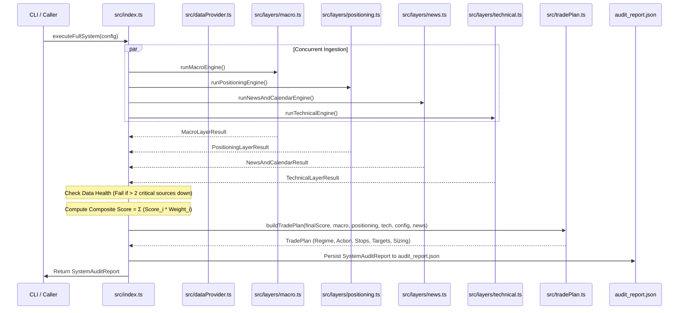

# TECHNICAL ARCHITECTURE & AI AGENT SPECIFICATION

> **Target Audience:** Autonomous AI coding agents, quantitative developers, and automated pipelines interacting with or refactoring this codebase.
> **Last Updated:** September 2026

---

## 1. System Invariants & Core Conventions

Any future AI agent modifying this codebase MUST respect these core system invariants:

1. **Sign Convention:**
   * **Negative Score ($-100$ to $0$):** Indicates **USD Advantage / EUR Weakness** (Bearish EUR/USD bias).
   * **Positive Score ($0$ to $+100$):** Indicates **EUR Advantage / USD Weakness** (Bullish EUR/USD bias).
   * **Zero ($0.0$):** Perfectly neutral fundamental parity.
2. **Thresholds & Layer Normalization:**
   * Conviction Threshold: $\pm 25.0$ (configured in `DEFAULT_CONFIG.convictionThreshold`).
   * Composite scores strictly bounded in $[-100.0, +100.0]$.
   * Continuous normalization must use hyperbolic tangent scaling (`tanhNormalize(z, sensitivity)`) rather than discrete knife-edge step functions to avoid boundary whipsaws.
3. **Technicals Policy:**
   * **Scoring Weight is 0% by default.** Technicals must NOT bias the fundamental composite score unless explicitly requested by the user or invoked via `--with-tech`.
   * **Local technical structure (5-day high/low) is reserved strictly for trade location, asymmetric invalidation anchoring, and ATR volatility budgeting.**
4. **Capital Preservation First:**
   * The engine must always prioritize capital preservation over trade frequency. Confluence Vetoes (Event-Risk, Short Squeeze, Liquidation) take absolute precedence over high conviction scores.
5. **No Synthetic Mocking in Production:**
   * Live endpoints must remain real-time HTTP calls with resilient fallback baselines rather than hardcoded mock stubs.

---

## 2. Architecture & Execution Lifecycle

The entry point is [`src/index.ts`](file:///src/index.ts) exporting `executeFullSystem(config?: SystemConfig): Promise<SystemAuditReport>`.



---

## 3. Data Providers & Ingestion Endpoints

All external I/O passes through `dataProvider` (`RobustDataProvider` singleton in [`src/dataProvider.ts`](file:///src/dataProvider.ts)):

| Data Metric | Provider / Endpoint | Fallback / Redundancy | Key Parameters / Series |
| :--- | :--- | :--- | :--- |
| **US 2Y Yield** | `https://fred.stlouisfed.org/graph/fredgraph.csv?id=DGS2` | Yahoo Finance `^IRX` | Series `DGS2`, daily |
| **US 10Y Yield** | `https://fred.stlouisfed.org/graph/fredgraph.csv?id=DGS10` | Yahoo Finance `^TNX` | Series `DGS10`, daily |
| **US 10Y TIPS** | `https://fred.stlouisfed.org/graph/fredgraph.csv?id=DFII10` | Baseline `2.63%` | 10Y Constant Maturity TIPS |
| **US 10Y Breakeven** | `https://fred.stlouisfed.org/graph/fredgraph.csv?id=T10YIE` | Baseline `2.35%` | 10Y Breakeven Inflation Rate |
| **Euro AAA 2Y Yield** | `https://data-api.ecb.europa.eu/service/data/YC/B.U2.EUR.4F.G_N_A.SV_C_YM.SR_2Y` | Baseline `2.10%` | Official ECB JSON API, `lastNObservations=35` |
| **Euro AAA 10Y Yield** | `https://data-api.ecb.europa.eu/service/data/YC/B.U2.EUR.4F.G_N_A.SV_C_YM.SR_10Y` | Baseline `2.35%` | Official ECB JSON API, `lastNObservations=35` |
| **Fed Funds EFFR** | `https://markets.newyorkfed.org/api/rates/unsecured/effr/last/30.json` | FRED `DFEDTARU`/`DFEDTARL` | NY Fed Reference Rates API |
| **ECB Deposit Rate** | `https://data-api.ecb.europa.eu/service/data/FM/B.U2.EUR.4F.KR.DFR.LEV` | Baseline `2.50%` | ECB DFR policy rate |
| **CFTC Euro FX CoT** | `https://publicreporting.cftc.gov/resource/6dca-aqww.json` | Baseline non-comm stats | Market Code `099741`, 52 weekly records |
| **Dutch TTF Gas** | `https://query1.finance.yahoo.com/v8/finance/chart/TTF=F` | Baseline `€73.9/MWh` | Yahoo Finance commodity quote |
| **Brent Crude** | `https://query1.finance.yahoo.com/v8/finance/chart/BZ=F` | Baseline `$95.00/bbl` | 3-month daily series |
| **VIX Index** | `https://query1.finance.yahoo.com/v8/finance/chart/^VIX` | Baseline `15.0` | 3-month daily series |
| **Live News Stream** | `@tiny-fish/sdk` (`client.search.query`) | Neutral sentiment | `domain_type: 'news'`, intent query |
| **Economic Calendar** | `https://nfs.faireconomy.media/ff_calendar_thisweek.json` | Empty array | High/Medium impact USD & EUR events |

### Caching & Timeout Contract
* `cacheTtlMs`: 5 minutes (`300,000 ms`). In-memory cache keyed by full URL.
* Timeout: `AbortSignal.timeout(7000)` on all network fetch operations.
* Retries: Exponential backoff ($800\text{ms} \times 2^{\text{attempt}-1}$).
* Health logs: Array of `DataSourceHealth` attached to every audit trail.

---

## 4. Mathematical & Normalization Models

### Hyperbolic Tangent Transformation
Unbounded metrics are normalized to the range $[-1.0, +1.0]$ using:
$$\text{normalizedScore} = \tanh\left(\frac{x}{\sigma}\right)$$
Where $\sigma$ represents the characteristic scale or volatility threshold of that metric.

### Layer 1: Macro Formulas
1. **Fast 2Y Spread Impulse (3-Day Delta, 25% Layer Weight):**
   $$\Delta_{3d} = S_{2Y}(t) - S_{2Y}(t-3)$$
   $$\text{Score}_{\text{fast}} = -\tanh\left(\frac{\Delta_{3d}}{0.08}\right)$$
   *(8 bps widening towards US within 72h represents a strong institutional repricing).*
2. **Medium 2Y Spread Momentum (10-Day Delta, 25% Layer Weight):**
   $$\Delta_{10d} = S_{2Y}(t) - S_{2Y}(t-10)$$
   $$\text{Score}_{\text{med}} = -\tanh\left(\frac{\Delta_{10d}}{0.15}\right)$$
   *(15 bps move over 10 trading days confirms multi-week swing trend).*
3. **10Y Sovereign Yield Spread Momentum (15% Layer Weight):**
   $$\text{Score}_{10Y} = -\tanh\left(\frac{\Delta_{10d}^{10Y}}{0.12}\right)$$
4. **10Y Real TIPS Advantage (15% Layer Weight):**
   $$\text{Score}_{\text{real}} = -\tanh\left(\frac{\text{TIPS}_{\text{US}} - 1.5}{1.5}\right)$$
5. **Energy Terms of Trade (10% Layer Weight):**
   Combines European TTF gas burden ($\frac{\text{TTF} - 35}{40}$) with Brent Crude 30-day Z-score:
   $$\text{Score}_{\text{energy}} = -\text{clamp}\left(0.4 \cdot \tanh(Z_{\text{Brent}}, 0.6) + 0.6 \cdot \tanh(\text{TTF}_{\text{burden}}, 0.8), -1.0, 1.0\right)$$
6. **Risk Regime & VIX Velocity (10% Layer Weight):**
   $$\text{VIX}_{\text{velocity}} = \text{VIX}(t) - \text{VIX}(t-5)$$

### Layer 2: Positioning (CoT) Formulas
* **52-Week CoT Index (%):**
  $$\text{CoT Index} = \frac{\text{Net} - \min_{52w}(\text{Net})}{\max_{52w}(\text{Net}) - \min_{52w}(\text{Net})} \times 100$$
* **Crowding Thresholds:**
  * Overbought Long: $\text{Index} \ge 80\%$
  * Oversold Short: $\text{Index} \le 20\%$
* **Flow Divergence:** If $\text{Index} \le 20\%$ and $\Delta_{4w}\text{Net} \ge +8,000$ contracts $\rightarrow$ `EXTREME_DIVERGENCE_REVERSAL` (Score $= +50.0$).

---

## 5. Decision Tree & Confluence Veto Hierarchy

Inside [`src/tradePlan.ts`](file:///src/tradePlan.ts), the decision tree processes in strict sequential order:

```
[Compute Final Score]
         │
         ▼
[Check VETO 0: Tier-1 Event Risk]
   Is High-Impact release due within [-1h, +6h]?
   ├─ YES ──► VETO TRIGGERED: STAND ASIDE (TIER_1_EVENT_RISK_GUARD)
   └─ NO  ──► Proceed
         │
         ▼
[Check VETO 1: Bearish Squeeze Divergence]
   Final Score <= -Threshold AND CoT == EXTREME_DIVERGENCE_REVERSAL?
   ├─ YES ──► VETO TRIGGERED: STAND ASIDE (FLOW_DIVERGENCE_SQUEEZE_VETO)
   └─ NO  ──► Proceed
         │
         ▼
[Check VETO 2: Bullish Liquidation Cascade]
   Final Score >= +Threshold AND CoT == EXTREME_DIVERGENCE_REVERSAL?
   ├─ YES ──► VETO TRIGGERED: STAND ASIDE (FLOW_DIVERGENCE_LIQUIDATION_VETO)
   └─ NO  ──► Proceed
         │
         ▼
[Directional Regime Check]
   ├─ Score <= -Threshold ──► BEARISH SWING PLAN (Sell on Pullback to 5d Resistance)
   ├─ Score >= +Threshold  ──► BULLISH SWING PLAN (Buy on Dip to 5d Support)
   └─ Between -25 and +25  ──► NEUTRAL_RANGE (Stand Aside / Capital Preservation)
```

---

## 6. Asymmetric Risk Geometry & Position Sizing

When a directional trade plan is generated:

1. **Structural Stop Loss Anchor:**
   * Short Stop: $\text{LocalSwingHigh}_{5d} + (\text{ATR}_{14} \times 0.35)$
   * Long Stop: $\text{LocalSwingLow}_{5d} - (\text{ATR}_{14} \times 0.35)$
   * **Rule:** Stops must NEVER be clipped inside the 5-day boundary.
2. **Location Guard & Entry Type:**
   * If current distance to stop $> 80\text{ pips}$ or RSI is exhausted:
     * Force `MICRO_PULLBACK_RETEST` with a **Limit Order Retracement** ($50\text{--}65\text{ pips}$ below stop).
     * Prevents shorting the bottom of a waterfall move or buying the top of a parabolic blow-off.
   * If local 5-day breakout is fresh and RSI is unexhausted:
     * `LOCAL_BREAKOUT_CONFIRMATION` immediate execution.
3. **Multi-Week Profit Targets:**
   * $\text{Take Profit 1} = 2.0 \times \text{StopDistance}$ ($1:2.0\text{ R:R}$)
   * $\text{Take Profit 2} = 4.0 \times \text{StopDistance}$ ($1:4.0\text{ R:R}$)
4. **Position Sizing Equation:**
   $$\text{DollarRisk} = \text{AccountEquity} \times \text{MaxRiskPct}$$
   $$\text{BaseLots} = \frac{\text{DollarRisk}}{\text{StopDistancePips} \times 10}$$
   $$\text{EffectiveLots} = \text{BaseLots} \times \text{SizingMultiplier}$$
   *(Note: SizingMultiplier is $0.70$ when positioning is crowded trend continuation, or $1.0$ otherwise).*

---

## 7. Instructions for Future AI Agents Modifying This Codebase

When tasked with updating, extending, or maintaining this codebase, adhere strictly to the following instructions:

1. **Adding a New Data Source:**
   * Add the network request inside [`src/dataProvider.ts`](file:///src/dataProvider.ts) wrapped in `dataProvider.fetchWithRetry` or `fetchTextWithRetry`.
   * Register the source in `healthLogs` with appropriate latency and status.
   * Provide an explicit, non-zero institutional fallback so an external API outage never crashes the entire trading loop.
2. **Adjusting Layer Weights:**
   * Layer weights are configured in [`src/types.ts`](file:///src/types.ts) within `DEFAULT_CONFIG.layerWeights`.
   * Ensure the active weights sum up to $1.00$ ($100\%$).
   * Keep `technical: 0.00` by default unless instructed otherwise.
3. **Modifying Types:**
   * All shared schemas reside in [`src/types.ts`](file:///src/types.ts).
   * Update `SystemAuditReport` if any new subfields are introduced to ensure `audit_report.json` captures the full serialized state.
4. **Verification Step:**
   * Always verify TypeScript compilation cleanly before completing tasks:
     ```bash
     bun x tsc --noEmit
     ```
   * Always execute a test run to confirm runtime output and JSON serialization:
     ```bash
     bun run src/index.ts
     ```
